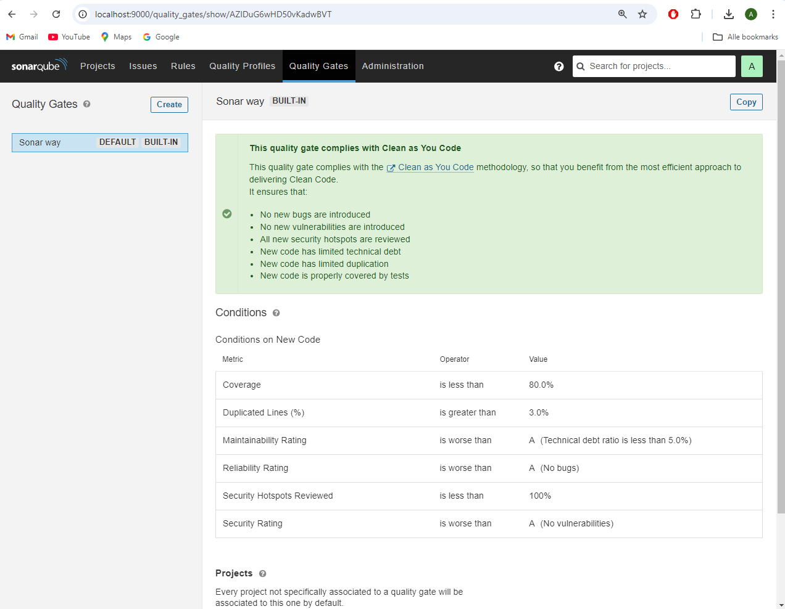
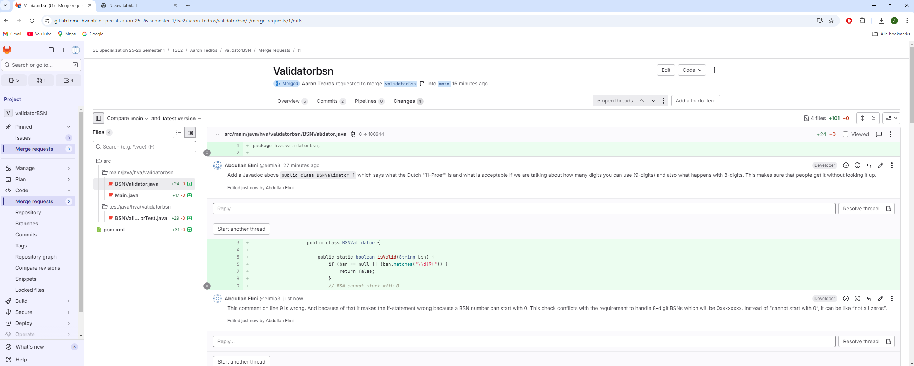
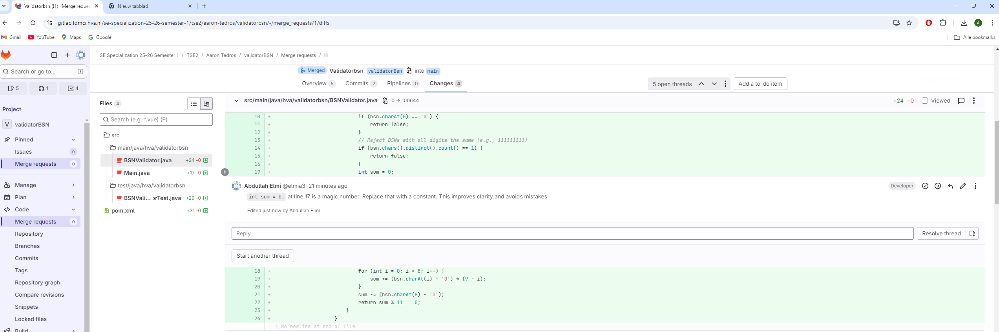
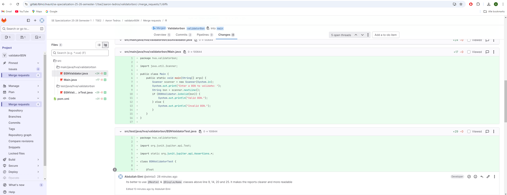
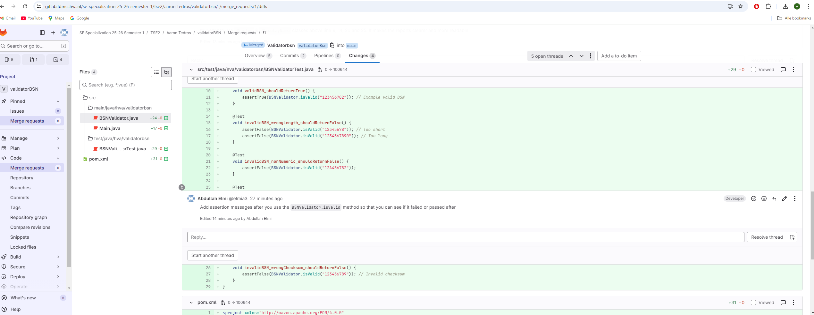

## Student Information

First Name: Abdullah

Last Name: Elmi

Student number: 500908247

## Assignment 1

### 1. Git log

```
6b305aax 2025-09-14     Merge branch 'feat/bsn-validator'
d18afd3x 2025-09-14     chore: added a png and changed the README.md
054cbb7x 2025-09-14     Merge branch 'main' of https://gitlab.fdmci.hva.nl/se-specialization-25-26-semester-1/tse2/abdullah-elmi/bsn-validator
49487f7x 2025-09-14     chore: reset main to tests-only state for review
cf84898x 2025-09-14     chore: update pom.xml to see the SonarQube Coverage
5a0a827x 2025-09-14     chore: ignore build and IDE files; untrack target/, .idea/, *.iml
169952ax 2025-09-14     chore: update .gitignore to exclude target directory
894b569x 2025-09-14     test: update BSN validator tests with valid 8-digit example
3fadfb9x 2025-09-14     feat: implement BSN validator logic (11-proef & input checks)
a84b08ex 2025-09-14     test: add failing BSN validator tests (valid/invalid cases)
bfabfa8x 2025-09-14     Initial commit
```

### 2. Sonarqube



The SonarQube analysis shows that my project passed the Quality Gate with the highest possible rating (A) for Reliability, Security, and Maintainability.
There are no bugs, vulnerabilities, or code smells detected. The test coverage is 97%, which means almost all lines in the BsnValidator class are tested.
In addition, the analysis shows 0% code duplication, which indicates that the implementation is clean and without redundant code.

### 3. Test Driven Development

Your best test class code snippets with a rationale why the unit tests are “good” tests.  Provide a link to the Test class and the class under test in Git.

```java
 @Nested
@DisplayName("Valid BSNs")
class ValidCases {
    @ParameterizedTest
    @DisplayName("Accepts known valid BSNs (11-proef, 9 digits)")
    @ValueSource(strings = {"286497153", "459980889", "808026598"})
    void validSamplesPass(String bsn) {
        assertTrue(validator.isValid(bsn));
    }

    @ParameterizedTest
    @DisplayName("8-digit BSNs are validated with an implied leading zero")
    @ValueSource(strings = {"72124581"})
        // This should be 072124581 and valid!
    void eightDigitInputsPass(String eightDigits) {
        assertTrue(validator.isValid(eightDigits));
    }
}

@Nested
@DisplayName("Invalid inputs")
class InvalidCases {
    @ParameterizedTest
    @DisplayName("Rejects bad formats and lengths")
    @ValueSource(strings = {"", "   ", "abc^%$gdebhe", "123-456-789","1234567890"})
    void badFormatsFail(String bsn) {
        assertFalse(validator.isValid(bsn));
    }

    @ParameterizedTest
    @DisplayName("Rejects numbers that fail the 11-proef")
    @ValueSource(strings = {"111111111", "123456789", "000000001"})
    void checksumFails(String bsn) {
        assertFalse(validator.isValid(bsn));
    }

    @ParameterizedTest
    @DisplayName("All zeros are invalid (8 or 9 digits)")
    @ValueSource(strings = {"00000000", "000000000"})
    void zerosAreInvalid(String bsn) {
        assertFalse(validator.isValid(bsn));
    }
}
```

[Class under test](https://gitlab.fdmci.hva.nl/se-specialization-25-26-semester-1/tse2/abdullah-elmi/bsn-validator/-/blob/main/src/main/java/nl/bsn/BsnValidator.java?ref_type=heads)

[Test class](https://gitlab.fdmci.hva.nl/se-specialization-25-26-semester-1/tse2/abdullah-elmi/bsn-validator/-/blob/main/src/test/java/nl/bsn/BsnValidatorTest.java?ref_type=heads)

### 4. Code Reviews

These are the screenshots of the code review I have done in GitLab on another student which is Aaron Tedros.






[GitLab Comments Link](https://gitlab.fdmci.hva.nl/se-specialization-25-26-semester-1/tse2/aaron-tedros/validatorbsn/-/merge_requests/1)